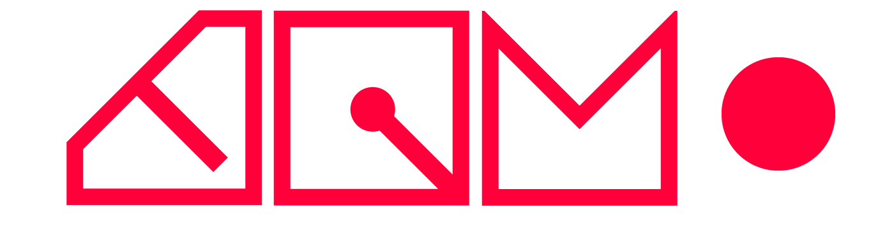

# TIM
Presentation du programme de techniques d'intégration multimédia à Montmorency

<iframe width="90%" height="500" src="https://www.youtube.com/embed/ABWCq8j8qys?si=U5u7Uobr_x_0VdUg" title="YouTube video player" frameborder="0" allow="accelerometer; autoplay; clipboard-write; encrypted-media; gyroscope; picture-in-picture; web-share" referrerpolicy="strict-origin-when-cross-origin" allowfullscreen></iframe>

# Esprit du programme

* Petits groupes
* Enseignement personnalisé
* Ambiance familiale

# Nos étudiantes et étudiants

<iframe width="90%" height="500" src="https://www.youtube.com/embed/otEUz0gCL7g" title="Entrevues étudiantes - Techniques d&#39;intégration multimédia (octobre 2020)" frameborder="0" allow="accelerometer; autoplay; clipboard-write; encrypted-media; gyroscope; picture-in-picture; web-share" referrerpolicy="strict-origin-when-cross-origin" allowfullscreen></iframe>

# Les grandes lignes 

* Création de contenus multimédia
* Réalisation d'expériences interactives
* Conception et développement de site Web

# Un programme pour qui?

### Pour celles et ceux qui s’intéressent aux : 

* Médias interactifs
* Jeu
* Programmation
* 3D
* Installations
* Création numérique
* 2D
* Conception audiovisuelle
* Nouvelles technologies

# On fait quoi en TIM ?

* Animation 2D-3D
* Web
* Programmation
* Installation
* Jeu interactif
* Vidéo
* Conception sonore

# Pourquoi Montmorency à Laval ?

## Studios multimédia haut de gamme

* Le grand studio comprend un espace principal de 1500 pi² incluant un cyclorama (écran sans coins) de 300 pi² (3 projecteurs laser permettent d'en éclairer la surface.) Le plancher, recouvert d'un tapis, peut-être démonté pour y cacher de l'équipement. 
* Le petit studio est composé de 2 espaces isolés acoustiquement, séparés par une porte et une fenêtre : une partie studio de 300 pi² et une régie de 100 pi². C'est l'endroit idéal pour effectuer des montages audio, des prises de sons ou des enregistrements.

## Laboratoires informatique performants

* 3 Laboratoires de 26 postes performants

## Équipement à la fine pointe

* 

# Les métiers

* Designer web
* Réalisateur vidéo
* Concepteur audio
* Scénographe multimédia
* Coordonnateur en multimédia
* Designer
* Développeur web
* Animateur 2d  

# Travailler en jeu vidéo ?

## OUI mais...

tu dois aller à l'université pour étudier dans la spécialité qui t'intéresse.

# Programmes universitaires
* Animation 3d & design numérique
* Design graphique
* Communication
* Arts visuels et médiatiques
* Cinéma
* Jeux vidéo 
* Design de jeu 
* Médias interactifs
* Génie logiciel

# Les chiffres

* Taux de placement : 90,9 %
* Salaire moyen : 28 $ / h
* Moyenne admission : 70 %

# Épreuve synthèse de programme

* Expérience multimédia interactive
  * [Crescentia](https://tim-montmorency.com/2024/)
  * [Mycélium](https://tim-montmorency.com/2023/)
  * [Moebius](https://tim-montmorency.com/2022/)
  * [Pandèmes](https://tim-montmorency.com/2021/)
* Stage: production web en entreprise
  

 

